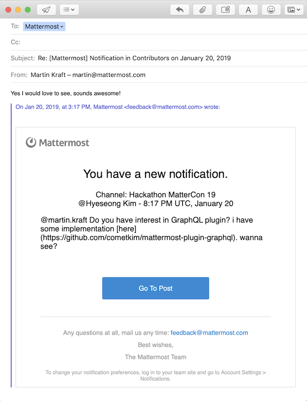

# Mailermost

Reply directly to an email notification...

...and the post appears in Mattermost.

## Requirements

* Mattermost v5.10

## Installation

1. Go to the [releases page of this Github repository](https://github.com/crspeller/mailermost-plugin/releases) and download the latest release for your Mattermost server.
2. In the Mattermost System Console under **System Console > Plugins > Plugin Management** upload the file to install the plugin. To learn more about how to upload a plugin, [see the documentation](https://docs.mattermost.com/administration/plugins.html#plugin-uploads).
3. In **System Console > Plugins > Mailermost**, configure the IMAP connection information for the email address that response emails will be sent to. The email address used is the address set in `EmailSettings.ReplyToAddress` in the Mattermost config.
4. Save your changes, then activate the plugin at **System Console > Plugins > Management** and ensure it starts with no errors.
